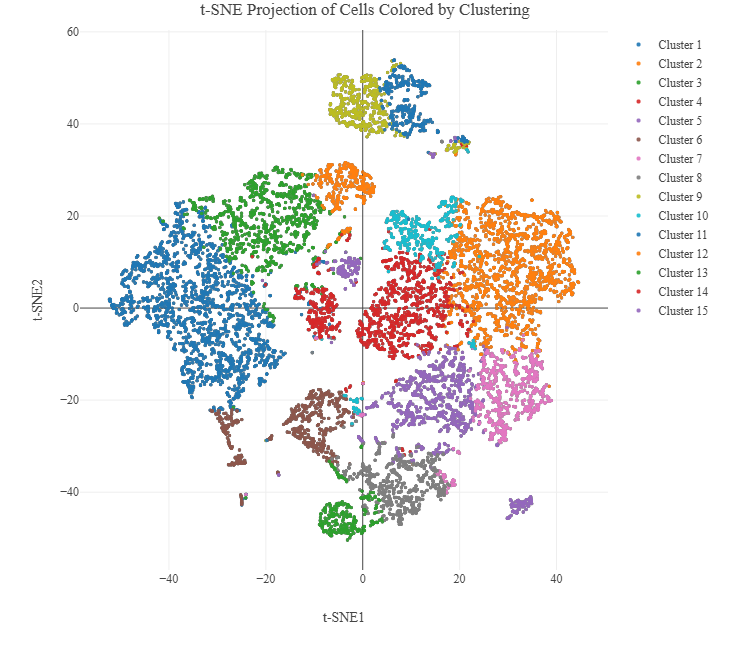
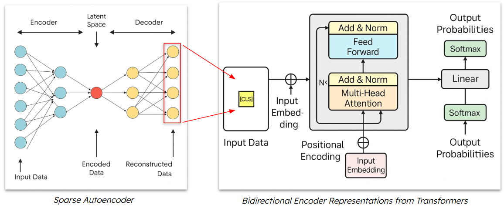

# Unveiling Latent Structural Collapse: A Discrete Morse Perspective on SAE Representations for Gene Expression

## Overview
<pre>
  <code>
    📁 Project Root
      ├── README.md                
      ├── SAE.py                  # Sparse Autoencoder model 
      ├── cellbert_runner.py      # BERT-based classifier runner
      ├── data_lookup.ipynb       # Data lookup and inspection notebook (Could neglect)
      ├── dm_full.py              # Discrete Morse skeleton code
      ├── pipeline.ipynb          # Full pipeline demo notebook 
      ├── presentation_url.txt    # Link to presentation video (*)
      ├── requirements.txt        # Python dependencies
      └── test.ipynb              # Test script / visualization checks
  </code>
</pre>

## Dataset
Before running this project, we should download the data from [Single Cell 3' Gene Expression]([https://example.com/myreport.pdf](https://www.10xgenomics.com/datasets/pbm-cs-from-a-healthy-donor-whole-transcriptome-analysis-3-1-standard-4-0-0)).
At "Output and supplemental files", I suggest to download "Feature / cell matrix HDF5 (filtered)" and "Clustering analysis". Put them into a folder called "data" in the root (if not exist, plz create one).
<table>
  <tr>
    <td>
    <td>
  </tr>
</table>

## Libraries
Plz refer to the requirements.txt. That would provide necessary depedencies (but might not satisfy all, as I might add more extensions to the project). If that happens, plz import needed libs by yourself.

## Latent Space by SAE and BERT

  

According to the pipeline, we will run a SAE multiple times for different latent space and apply them to BERT models for classification tasks. 

